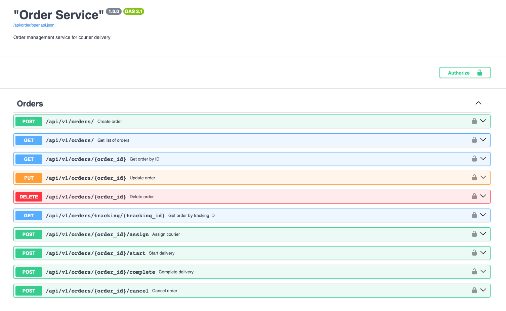

# Order Service

[](https://www.python.org/downloads/release/python-3130/)
[](https://fastapi.tiangolo.com/)
[](LICENSE.md)
[](https://github.com/sendhello/order-service/actions/workflows/codeql.yml)

A microservice for managing courier delivery orders with multi-tenant architecture support.

## Table of Contents

- [Features](#features)
- [Tech Stack](#tech-stack)
- [Architecture](#architecture)
- [Prerequisites](#prerequisites)
- [Installation](#installation)
- [Usage](#usage)
- [API Documentation](#api-documentation)
- [Development](#development)
- [Testing](#testing)
- [Environment Variables](#environment-variables)
- [Deployment](#deployment)
- [Security](#security)
- [Contributing](#contributing)
- [License](#license)
- [Authors](#authors)

## Features

- 🚚 **Order Management**: Create, read, update, and delete delivery orders
- 👥 **Multi-tenant Architecture**: Support for multiple organizations
- 📦 **Package Details**: Detailed package information including dimensions and weight
- 📍 **Location Tracking**: GPS coordinates for pickup and delivery locations
- 🕐 **Time Windows**: Flexible delivery time scheduling
- 💳 **Payment Integration**: Multiple payment methods support
- 🔐 **JWT Authentication**: Secure API access
- 📊 **Distributed Tracing**: OpenTelemetry integration with Jaeger
- 🔍 **Order Tracking**: Real-time order status tracking
- 📱 **RESTful API**: Clean and well-documented API endpoints

## Tech Stack

- **Backend Framework**: [FastAPI](https://fastapi.tiangolo.com/) 0.115.14
- **Language**: Python 3.13
- **Database**: PostgreSQL with [SQLAlchemy](https://www.sqlalchemy.org/) ORM
- **Cache**: Redis
- **Authentication**: JWT with async-fastapi-jwt-auth
- **Migration**: Alembic
- **Validation**: Pydantic v2
- **Tracing**: OpenTelemetry + Jaeger
- **ASGI Server**: Uvicorn
- **Containerization**: Docker & Docker Compose

## Architecture

```
  ┌─────────────────┐    ┌─────────────────┐    ┌─────────────────┐
  │   Client Apps   │    │   Web Client    │    │   Mobile Apps   │
  └─────────┬───────┘    └────────┬────────┘    └─────────┬───────┘
            │                     │                       │
            └─────────────────────┼───────────────────────┘
                                  │
                    ┌─────────────┴─────────────┐
                    │      Auth Service         │
                    │   (FastAPI + JWT + OAuth) │
                    └─────────────┬─────────────┘
                                  │
                    ┌─────────────┴─────────────┐
                    │    Order Service          │
                    │  (Consumes JWT tokens)    │
                    └───────────────────────────┘
                                  │
              ┌───────────────────┼───────────────────┐
              │                   │                   │
    ┌─────────▼─────────┐ ┌───────▼────────┐ ┌────────▼─────────┐
    │   PostgreSQL      │ │     Redis      │ │   Other Services │
    │   (Order Data)    │ │    (Cache)     │ │ (Future Services)│
    └───────────────────┘ └────────────────┘ └──────────────────┘
```

## Prerequisites

- **Python**: 3.13 or higher
- **Docker**: 20.10 or higher
- **Docker Compose**: 2.0 or higher
- **PostgreSQL**: 14 or higher (if running locally)
- **Redis**: 6.2 or higher (if running locally)

## Installation

### Option 1: Docker (Recommended)

1. **Clone the repository**
   ```bash
   git clone <repository-url>
   cd order-service
   ```

2. **Build and start services**
   ```bash
   docker compose up --build
   ```

The service will be available at `http://localhost:8000`

### Option 2: Local Development

1. **Clone the repository**
   ```bash
   git clone <repository-url>
   cd order-service
   ```

2. **Create virtual environment**
   ```bash
   python3.13 -m venv .venv
   source .venv/bin/activate  # On Windows: .venv\Scripts\activate
   ```

3. **Install dependencies**
   ```bash
   pip install -r requirements.txt
   # or if using poetry
   poetry install
   ```

4. **Set up environment variables**
   ```bash
   cp .env.example .env.local
   # Edit .env.local with your configuration
   export $(grep -v -E '^\s*(#|$)' .env.local | xargs)
   ```

5. **Start infrastructure services**
   ```bash
   docker compose -f docker-compose-dev.yml up -d
   ```

6. **Run database migrations**
   ```bash
   python manage.py migrate
   ```

7. **Start the application**
   ```bash
   uvicorn main:app --host 0.0.0.0 --port 8000 --reload
   ```

## Usage

### Basic API Usage

```bash
# Create an order
curl -X POST "http://localhost:8000/api/v1/orders/" \
  -H "Authorization: Bearer <your-jwt-token>" \
  -H "Content-Type: application/json" \
  -d '{
    "title": "Package Delivery",
    "recipient": {
      "first_name": "John",
      "last_name": "Doe",
      "phone": "+1234567890",
      "address": "123 Main St, City, State"
    },
    "package_details": [{
      "type": "package",
      "weight": 1.5,
      "description": "Electronics"
    }]
  }'

# Get order by ID
curl -X GET "http://localhost:8000/api/v1/orders/{order_id}" \
  -H "Authorization: Bearer <your-jwt-token>"

# Track order
curl -X GET "http://localhost:8000/api/v1/orders/tracking/{tracking_id}" \
  -H "Authorization: Bearer <your-jwt-token>"
```


### Swagger Interface Preview



*Interactive API documentation interface showing all available endpoints, request/response schemas, and the ability to test API calls directly from the browser.*


## API Documentation

Once the service is running, you can access:

- **Swagger UI**: [http://localhost:8000/api/orders/openapi](http://localhost:8000/api/orders/openapi)
- **OpenAPI JSON**: [http://localhost:8000/api/orders/openapi.json](http://localhost:8000/api/orders/openapi.json)

### Main Endpoints

| Method | Endpoint | Description |
|--------|----------|-------------|
| `POST` | `/api/v1/orders/` | Create a new order |
| `GET` | `/api/v1/orders/` | Get list of orders (paginated) |
| `GET` | `/api/v1/orders/{order_id}` | Get order by ID |
| `GET` | `/api/v1/orders/tracking/{tracking_id}` | Get order by tracking ID |
| `PUT` | `/api/v1/orders/{order_id}` | Update order |
| `DELETE` | `/api/v1/orders/{order_id}` | Delete order |
| `POST` | `/api/v1/orders/{order_id}/assign` | Assign courier |
| `POST` | `/api/v1/orders/{order_id}/start` | Start delivery |
| `POST` | `/api/v1/orders/{order_id}/complete` | Complete delivery |
| `POST` | `/api/v1/orders/{order_id}/cancel` | Cancel order |

## Development

### Code Quality Tools

We use several tools to maintain code quality:

```bash
# Format code
black --skip-string-normalization .

# Sort imports
isort .

# Lint code (modern alternative to flake8)
ruff check .

# Type checking
mypy .

# Security scanning
bandit -r .
```

### Pre-commit Hooks

Install pre-commit hooks to ensure code quality:

```bash
pre-commit install
```

### Database Migrations

```bash
# Create new migration
alembic revision --autogenerate -m "Description of changes"

# Apply migrations
alembic upgrade head

# Downgrade migration
alembic downgrade -1
```

### Project Structure

```
order-service/
├── api/                    # API endpoints
│   └── v1/                # API version 1
├── constants/             # Application constants
├── core/                  # Core application logic
├── db/                    # Database configuration
├── middleware/            # Custom middleware
├── migrations/            # Database migrations
├── models/                # SQLAlchemy models
├── schemas/               # Pydantic schemas
├── security/              # Authentication logic
├── services/              # Business logic
├── main.py                # Application entry point
├── manage.py              # Management commands
└── pyproject.toml         # Project configuration
```

## Testing

### Running Tests

```bash
# Run all tests
pytest -vv

# Run tests with coverage
pytest --cov=. --cov-report=html

# Run specific test file
pytest tests/test_orders.py -v

# Run tests in parallel
pytest -n auto
```

### Test Structure

```
tests/
├── conftest.py           # Test configuration
├── test_orders.py        # Order endpoint tests
├── test_models.py        # Model tests
└── test_services.py      # Service layer tests
```

## Environment Variables

| Variable | Default | Description |
|----------|---------|-------------|
| `DEBUG` | `false` | Enable debug mode |
| `PROJECT_NAME` | `Order Service` | Service name (displayed in docs) |
| `POSTGRES_HOST` | `localhost` | PostgreSQL hostname |
| `POSTGRES_PORT` | `5432` | PostgreSQL port |
| `POSTGRES_DB` | `orders` | Database name |
| `POSTGRES_USER` | `app` | Database username |
| `POSTGRES_PASSWORD` | - | Database password |
| `REDIS_HOST` | `localhost` | Redis hostname |
| `REDIS_PORT` | `6379` | Redis port |
| `AUTHJWT_SECRET_KEY` | - | JWT secret key |
| `JAEGER_TRACE` | `false` | Enable Jaeger tracing |
| `JAEGER_AGENT_HOST` | `localhost` | Jaeger agent hostname |
| `JAEGER_AGENT_PORT` | `6831` | Jaeger agent port |

## Deployment

### Docker Production Build

```bash
# Build production image
docker build -t order-service:latest .

# Run with production settings
docker run -d \
  --name order-service \
  -p 8000:8000 \
  --env-file .env.prod \
  order-service:latest
```

### System Requirements

- **Minimum**: 1 CPU, 1GB RAM
- **Recommended**: 2 CPU, 2GB RAM
- **Storage**: 10GB for logs and temporary files

## Security

Security is a top priority for this project. We have implemented multiple security measures and follow best practices to ensure the safety of your data.

### Security Features

- **Multi-tenant Architecture**: Row Level Security (RLS) ensures data isolation between organizations
- **JWT Authentication**: Secure token-based authentication system
- **Input Validation**: All API inputs are validated using Pydantic schemas
- **SQL Injection Protection**: SQLAlchemy ORM with parameterized queries
- **Distributed Tracing**: OpenTelemetry integration for audit trails
- **Secure Error Handling**: Error responses don't leak sensitive information

### Reporting Security Vulnerabilities

If you discover a security vulnerability, please follow our responsible disclosure process outlined in our [Security Policy](SECURITY.md).

**Please do not create public GitHub issues for security vulnerabilities.** Instead, email us directly at bazhenov.in@gmail.com with details about the vulnerability.

### Security Best Practices

When deploying and using this service:

- Use strong, unique JWT secret keys
- Enable HTTPS in production
- Keep dependencies up to date
- Use secure database connections (SSL/TLS)
- Implement proper network security measures
- Regular security audits and monitoring

For detailed security information, please see our [Security Policy](SECURITY.md).

## Contributing

1. Fork the repository
2. Create a feature branch (`git checkout -b feature/amazing-feature`)
3. Make your changes
4. Add tests for new functionality
5. Ensure all tests pass (`pytest`)
6. Run code quality checks (`ruff check .`, `mypy .`)
7. Commit your changes (`git commit -m 'Add amazing feature'`)
8. Push to the branch (`git push origin feature/amazing-feature`)
9. Open a Pull Request

### Code Style Guidelines

- Follow PEP 8 style guide
- Use type hints for all functions
- Write docstrings for all public methods
- Maintain test coverage above 80%
- Use meaningful commit messages

## License

This project is licensed under the Apache License 2.0 - see the [LICENSE](LICENSE) file for details.

## Authors

- **Ivan Bazhenov** - *Initial work* - [@sendhello](https://github.com/sendhello)
  - Email: bazhenov.in@gmail.com

## Support

For support and questions:

- Create an issue on GitHub
- Contact the maintainer via email
- Check the documentation at `/docs` endpoint

---

Built with ❤️ using FastAPI and Python 3.13